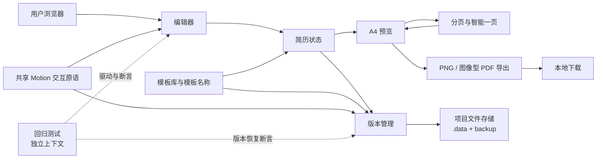

# 架构与数据流

本文件描述 ZineCV 当前实现的高层关系，不替代源码、类型定义或回归测试。可交互图由 Archify 生成：

- [打开交互式架构图](architecture.html)
- [查看 Archify 源规格](architecture.archify.json)
- 图中的源码证据固定到规格声明的提交；每次推送时 GitHub Actions 会把规格临时指向该推送提交，重新校验并交付该提交对应的架构图工件。

## 主链路

## 组件职责

| 组件           | 主要入口                                                              | 职责                                                                           |
| -------------- | --------------------------------------------------------------------- | ------------------------------------------------------------------------------ |
| 编辑器         | `src/components/editor/`、`src/app/useResumeEditing.ts`               | 接收表单、富文本、模块排序和模板编辑动作。                                     |
| 简历状态       | `src/domain/`、`src/app/useResumePersistence.ts`                      | 维护简历模型、模板上下文、排版偏好和浏览器草稿。                               |
| A4 预览        | `src/components/preview/`                                             | 把同一份状态渲染为固定纸张；预览外交互层负责定位和悬停提示。                   |
| 分页与智能一页 | `src/app/useResumePagination.ts`、`src/services/resume-pagination.ts` | 使用真实字体和纸张高度测量页块，生成多页结果或一次性智能适配。                 |
| 导出           | `src/services/resume-export.ts`                                       | 从 A4 纸张生成高清 PNG 和图像型 PDF，不把交互轮廓写入导出物。                  |
| 版本管理       | `src/app/useResumeVersions.ts`、`src/components/versioning/`          | 创建提交、维护分支关系、切换和恢复版本。                                       |
| 模板库与模板名 | `src/domain/template-library.ts`、`src/components/templates/`         | 在本地管理模板及名称；版本历史按当前模板名称展示归属。                         |
| 交互动效       | `src/motion/`、`src/components/editor/AnimatedCollapse.tsx`           | 统一共享动效参数、控件反馈和编辑模块展开/收起过渡。                            |
| 项目文件存储   | `server/version-storage.mjs`、`src/services/version-storage.ts`       | 在本地开发/预览服务下原子写入 `.data/versions.json`，并保留备份。              |
| 回归测试       | `scripts/`、`package.json` 中的 `test:*` 脚本                         | 在独立浏览器上下文和临时数据目录中验证编辑、预览、导出、模板、版本及保护边界。 |

## 关键关系

1. 编辑器只提交用户动作；简历状态是编辑器、预览、模板和版本流程共享的单一事实来源。
2. 预览和导出读取同一份排版状态。分页先测量 A4 内容，再把页块结果交给预览和导出，因此预览页数、导出页数和智能一页判断必须一致。
3. 版本管理保存状态快照和分支关系，不直接修改 `.data` 外的源代码。项目文件服务使用临时文件和原子替换，写入失败时保留原文件。
4. 回归测试不使用用户当前页面或用户 `.data`。浏览器测试只验证运行时行为；`test:release-docs` 还会核对固定预览基线、素材状态和公开发布边界。

## 数据边界

- 浏览器本地数据：草稿、排版偏好、模块顺序、模板识别结果、独立的收藏/最近使用元数据和未提交版本。
- 项目本地数据：`.data/versions.json` 与 `.data/versions.backup.json`。它们属于用户版本库，已加入 `.gitignore`，不会进入 GitHub。
- 可重建产物：`dist/`、`.artifacts/`、覆盖率和构建缓存。它们不进入版本库。
- 可发布源码：`src/`、`server/`、`scripts/`、配置、锁文件和文档。
- 受单独授权边界约束的资源：`public/fonts/` 以及默认示例内容。不要把项目 `LICENSE` 解释为这些资源的再授权。

## 预览与动效边界

右侧 A4 正文、字体、分页、导出和固定纸张几何属于保护契约。界面动效只负责工作区导航、控件反馈、浮层和拖拽让位；纸张之外的模块轮廓不进入文档流、打印或导出。新增动效需要同时考虑键盘、触屏和系统“减少动态效果”设置。

涉及 A4 内容、字体、分页或导出时，先阅读 `AGENTS.md` 和 [工程维护状态](maintenance-status.md)，再运行最小相关回归；不要用重新生成基线的方式掩盖差异。

## 文档和图谱更新

架构图是源码关系的可读索引，不是运行时依赖。新增或移动跨模块入口时同步更新 `architecture.archify.json` 和本文件，并重新执行 Archify 校验；代码修改仍需通过 `npm run check` 及对应的功能回归。GitNexus、ast-grep 和 Archify 的结果都必须回到当前源码和测试中核对。

每次 GitHub 推送都会在 Actions 中刷新该提交的 GitNexus 临时索引、执行 ast-grep 源码结构扫描，并生成带推送提交号的 Archify 架构图。日志和 `code-intelligence-<提交号>` 工件用于查看结果；CI 不会写回仓库或本地开发目录。
